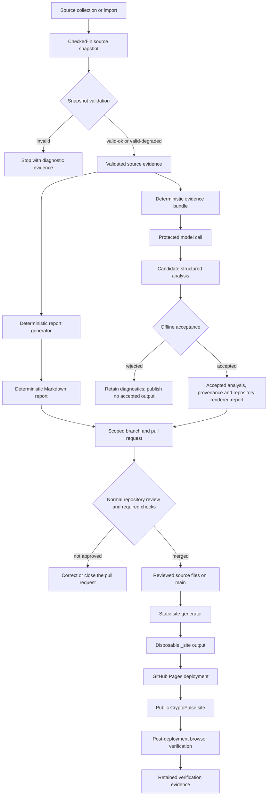

# How CryptoPulse works

> **Mode:** Explanation  
> **Audience:** CryptoPulse architects, contributors, operators and governance reviewers  
> **Outcome:** Understand how source evidence can become a public CryptoPulse page, where deterministic and governed analysis diverge, and which authority controls each transition.

CryptoPulse is built around an evidence spine rather than around a model response or a generated website. Checked-in source snapshots, reviewed report sources and repository-owned contracts are the durable inputs. Analysis, rendering, deployment and browser evidence sit around that spine, but none becomes authoritative merely because it was generated successfully.

The system therefore separates four questions:

1. Is the source evidence usable?
2. What report or analysis may be derived from that evidence?
3. Which source files may enter the repository?
4. Which reviewed repository state may be published?

No single workflow, model call or generated artefact answers all four.

## End-to-end flow



The deterministic and governed paths diverge after source validation and converge only at a normal pull request. A model can propose structured analysis, but it cannot validate the source, author arbitrary document structure, push accepted files from its secret-bearing job, merge the pull request or deploy the site.

## 1. Source evidence enters the repository

CryptoPulse works from immutable source snapshots under `data/crypto/hourly/`. A snapshot records market and source-status evidence at a particular observation time. It is not trusted merely because it is checked in.

The snapshot validator recomputes its quality against reviewed source configuration and classifies it as:

- `valid-ok`;
- `valid-degraded`; or
- `invalid`.

An invalid snapshot stops downstream processing. A degraded snapshot may proceed, but its limitations must remain visible rather than being silently normalised into complete evidence.

For the operating procedure, see [Validate a source snapshot](../how-to/validate-a-source-snapshot.md). For exact quality states and source criticality, see [Source snapshot quality](../reference/source-snapshot-quality.md).

## 2. Deterministic reporting derives a report without a model

The deterministic path turns one accepted snapshot into repository-owned Markdown using reviewed code and configuration. It performs no provider call and adds no hidden market research.

This path is useful for two reasons. First, it creates a report whose values and limitations can be reproduced directly from the source snapshot. Second, it keeps the core evidence archive usable when an optional model is unavailable, ineligible or rejected.

The generator writes a report source beneath `reports/crypto/hourly/`. That Markdown is not published merely because generation succeeded. The generating workflow proves report validation, tests, site generation, rendered-path existence and changed-file scope before it opens a pull request. Normal repository review still decides whether the source enters `main`.

The precise report shape belongs to [Deterministic report schema](../reference/deterministic-report-schema.md). The required pre-pull-request proof belongs to [Generated report PR evidence](../reference/generated-report-pr-evidence.md).

## 3. Governed analysis proposes claims inside a narrower boundary

Optional governed analysis begins from the same validated source snapshot, but repository code first projects that snapshot into a smaller evidence bundle. Each permitted fact receives a stable evidence identifier before any provider call occurs.

A protected model call receives the evidence bundle as untrusted data and returns candidate structured JSON. The model may select and organise supported observations, but it does not create evidence and does not return a finished Markdown document with publication authority.

Repository code then applies ordered offline checks for:

- schema validity;
- evidence-reference integrity;
- value and unit consistency;
- permitted claim semantics;
- policy boundaries; and
- deterministic rendering.

A rejected result retains diagnostic evidence where possible but produces no accepted analysis or report source. An accepted result can become three controlled source files—analysis JSON, provenance JSON and repository-rendered Markdown—only through the write-capable stage of the rolling-review workflow. That stage has no provider secret and opens or updates a normal pull request rather than merging or publishing directly.

For the conceptual boundary, see [Evidence and analysis boundary](evidence-and-analysis-boundary.md). For exact claim and provenance rules, see [Governed analysis contract](../reference/governed-analysis-contract.md). For workflow jobs and permissions, see [Governed LLM workflows](../reference/governed-llm-workflows.md).

## 4. Trust and write authority remain separated

The governed workflow divides authority across jobs:

```text
secret-free preparation
        ↓
secret-bearing, read-only generation
        ↓
scrubbed accepted artefact
        ↓
secret-free, write-capable proof and pull-request update
```

This arrangement prevents pull-request code from receiving the provider credential and prevents the secret-bearing generation job from writing its own output into the repository.

Acceptance is also distinct from approval. Deterministic validators may prove that a candidate is inside the governed contract, but normal pull-request review decides whether the resulting source files should be merged. See [Trusted main and secret isolation](trusted-main-and-secret-isolation.md) for the rationale behind these execution boundaries.

## 5. Both report paths converge on normal repository review

A deterministic report and an accepted governed report follow different generation paths, but both must arrive as reviewable source changes on a scoped branch.

Normal repository delivery provides the common control point:

1. the intended changed-file scope is visible;
2. unit and documentation validation run;
3. the complete static site is rebuilt;
4. generated `_site/` output is rejected from source control;
5. reviewers can inspect source evidence, report content and provenance appropriate to the path;
6. only a reviewed pull request may merge into `main`.

The normal delivery procedure is [Deliver a repository slice](../how-to/deliver-a-repository-slice.md). Governed generation-specific review is described in [Create a governed rolling-review pull request](../how-to/create-governed-rolling-review-pr.md).

## 6. The static site is rebuilt from reviewed sources

Once source files are on `main`, the site generator transforms the current report archive and repository-owned assets into `_site/`.

`_site/` is disposable deployment output. It is not an independent content authority and must not be committed. A clean build removes any old output before deriving homepage, latest-report, archive, search, feed and individual report views from the current repository state.

This means presentation can evolve through reviewed generator and asset changes without editing archived reports or generated HTML by hand. The rationale is described in [Deterministic site generation](deterministic-site-generation.md), and exact output paths are listed in [Generated site artefacts](../reference/generated-site-artefacts.md).

## 7. Deployment publishes a reviewed repository state

The GitHub Pages workflow checks out `main`, runs the canonical site generator, uploads `_site/` as a Pages artefact and deploys it through the `github-pages` environment.

Deployment does not turn workflow evidence, raw provider output or a pull-request branch into public content. It publishes the site derived from the reviewed source state selected by the deployment workflow.

For the operating procedure, see [Publish the static site](../how-to/publish-the-static-site.md).

## 8. Live verification observes the deployed result

After deployment, a browser-based workflow checks the public homepage, latest report, archive and search experience. It records HTTP, document, navigation, accessibility and CryptoPulse-specific assertions in a retained evidence bundle.

That evidence proves what the verifier observed at the public URL. It does not replace the source commit, build artefact or pull-request evidence that produced the deployment.

For the procedure, see [Verify the live site](../how-to/verify-the-live-site.md). For the retained file contract, see [Live-site evidence artefact](../reference/live-site-evidence-artefact.md).

## Artefact classes

| Class | Examples | Authority |
| --- | --- | --- |
| Canonical repository source | Source snapshots, accepted analysis and provenance, Markdown reports, schemas, prompts, configuration, generator code and site assets | Reviewed repository state; exact ownership remains with the relevant implementation or contract file. |
| Disposable generated output | `_site/` HTML, indexes, feed and copied assets | Rebuilt for validation and deployment; never an independent source of truth. |
| Retained workflow evidence | Dry-run completion and validation records, Actions summaries, browser captures and accessibility results | Evidence of an execution or observation; not automatically publishable source. |
| Historical records | Planning records, evaluation evidence, issues and pull-request discussions | Explain intent, decisions and delivery history; not current operating authority. |

## Authority by transition

| Transition | Deciding authority |
| --- | --- |
| Snapshot → usable evidence | Source validator and reviewed source configuration |
| Usable evidence → deterministic report candidate | Deterministic report generator |
| Evidence bundle → candidate governed analysis | Pinned model under the versioned prompt |
| Candidate analysis → accepted governed output | Repository schemas, validators, policy checks and deterministic renderer |
| Candidate source files → `main` | Normal pull-request review, required checks and merge authority |
| Reviewed `main` → `_site/` | Static-site generator |
| `_site/` → public site | GitHub Pages deployment workflow and environment |
| Public site → verification evidence | Post-deployment browser workflow |

The central design rule is that generation, acceptance, merge and publication are different authorities. CryptoPulse remains governable because no generated result can silently cross all of them.
