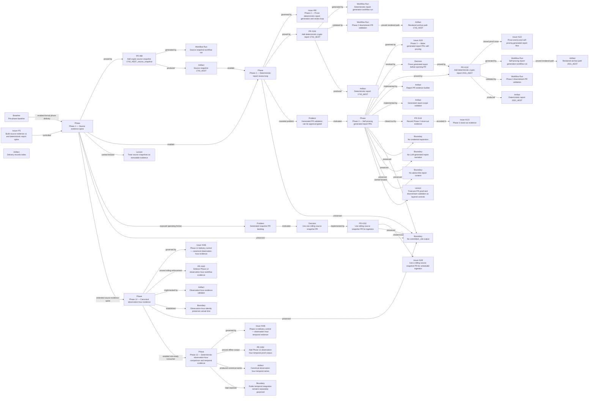

# CryptoPulse delivery graph

This file is generated from `planning/delivery/delivery.yaml` by `scripts/render_delivery_graph.py`.

The graph is a curated navigation layer over GitHub issues, pull requests, workflow runs, commits, and delivery records. It is not the canonical audit trail.

